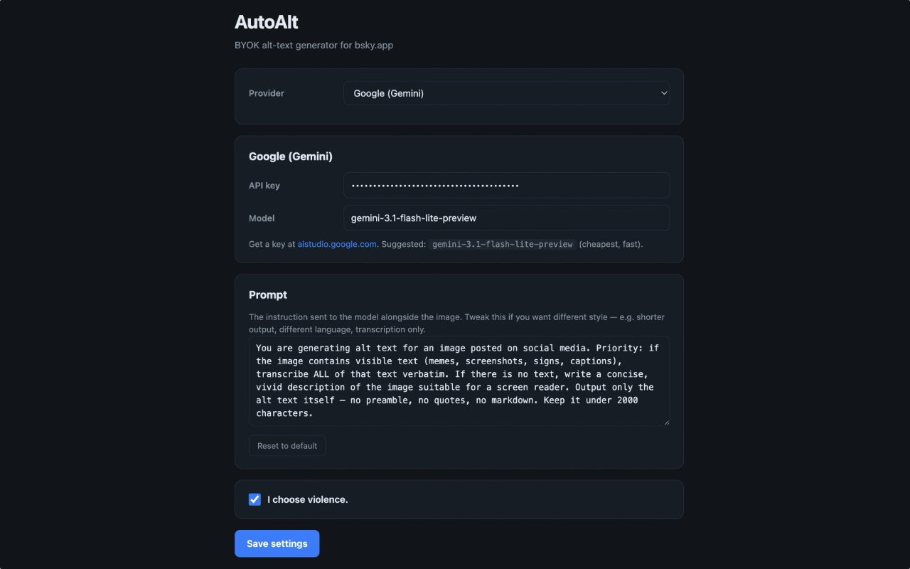

# AutoAlt

A Chrome extension that generates alt text for images you post to Bluesky, using a vision model of your choice. Bring your own key.

It's tuned especially for **images that contain text** — memes, screenshots, signs, diagrams. The default prompt asks the model to transcribe any visible text verbatim, and only fall back to description if the image has no text. (You can change that prompt; see below.)

## How it looks

When you attach an image to a Bluesky post, an **✨ Auto** button appears next to Bluesky's own **+ ALT** chip in the upper-left of the thumbnail.


Click it. After a second or two, the alt-text field fills in. If the alt-text dialog wasn't open yet, AutoAlt opens it, fills it, and clicks Done for you.


That's the whole UI. There's no streaming, no preview, no review step — it just writes the alt text. You can always click **+ ALT** afterwards to read or edit what it came up with.

Provider, model, prompt, and the optional attribution footer are all configurable in Settings:



## Supported providers

| Provider  | Default model                   | Get a key                                            |
| --------- | ------------------------------- | ---------------------------------------------------- |
| OpenAI    | `gpt-5.4-nano`                  | https://platform.openai.com/api-keys                 |
| Anthropic | `claude-haiku-4-5`              | https://console.anthropic.com/settings/keys          |
| Google    | `gemini-3.1-flash-lite-preview` | https://aistudio.google.com/app/apikey               |
| Ollama    | `gemma4:e2b` (local)            | install from https://ollama.com — see section below  |

API requests go directly from your browser to the provider you picked. Nothing routes through any third party. You can swap the model name in Settings if you want a beefier or cheaper one.

> **Note on Anthropic:** A **Claude Pro or Claude Max subscription does not work here.** Those are consumer chat plans for [claude.ai](https://claude.ai) and Claude Code — they don't include API access. AutoAlt needs an API key from the [Anthropic Console](https://console.anthropic.com/settings/keys), which is billed separately (pay-as-you-go, usually pennies). The same distinction applies to OpenAI: a ChatGPT Plus subscription is not an OpenAI API key.

## Which one should I pick?

**For most people, the answer is Google Gemini.** Generating alt text for one image is on the order of a few hundredths of a cent at frontier-model prices, and Google's free tier is more than generous enough to cover any reasonable amount of social-media posting at zero dollars. You will not run out. Anthropic and OpenAI are both excellent and similarly cheap if you'd rather give them your business — Anthropic's Claude Haiku 4.5 in particular tends to be the sharpest at OCR on dense or hard-to-read images. Either way, you're talking pocket change.

**Ollama is the privacy-or-bust option, not the budget option.** It's tempting to assume that "free local model" beats "fractions of a cent," but in practice the small vision models Ollama can run on consumer hardware — `gemma4:e2b`, `qwen2-vl`, `llava`, etc. — produce noticeably more inconsistent results than frontier models. They miss text, hallucinate text that isn't there, and make worse judgment calls about what's worth describing. They're also 3–4× slower (see the Ollama section). The right reasons to choose Ollama are: you genuinely need your images to never leave your machine, or you're offline, or you enjoy tinkering. If your goal is "cheap and good," use Gemini's free tier instead.

## Install

The extension isn't on the Chrome Web Store — install it as an unpacked extension:

1. Download or clone this folder somewhere stable on your machine.
2. Open Chrome and go to `chrome://extensions`.
3. Toggle **Developer mode** on (top-right corner).
4. Click **Load unpacked** and select the `autoalt/` folder.
5. The Settings page opens automatically on first install. Pick your provider, paste your API key, click **Save settings**.
6. Open https://bsky.app, start a post, attach an image — click the **✨ Auto** button.

If you ever update the extension code, hit the reload icon on the AutoAlt card in `chrome://extensions`. **You also need to refresh any open Bluesky tabs after a reload** — the old content script in those tabs gets orphaned and won't be able to talk to the rebuilt service worker. AutoAlt will tell you so if you click the button before refreshing.

## Settings

Open Settings via the toolbar icon → **Settings**, or from `chrome://extensions` → AutoAlt → Details → Extension options.

- **Provider** — which API to use. Each provider has its own pane below for keys, model name, etc.
- **API key / endpoint** — your credentials. Stored in `chrome.storage.local` on this machine only.
- **Model** — leave blank to use the default for that provider, or override with any vision-capable model the provider exposes (e.g. `gpt-5-mini`, `claude-sonnet-4-5`, `gemini-3.0-pro`, `qwen2-vl`).
- **Prompt** — the instruction sent to the model alongside each image. Default prioritises text transcription. Edit if you want shorter alt text, a different language, a more descriptive style, transcription-only, or anything else.
- **I choose violence.** — when checked, AutoAlt appends `[This alt text added by <model> AI]` to every alt text it generates. Default off. Use at your own social risk.

## Using Ollama (local, free)

Ollama is the fully-local option. It runs the vision model on your own GPU/Neural Engine, so nothing about your image ever leaves your machine. There are two real trade-offs:

- **Speed.** In testing on an **M4 Max Mac Studio**, Gemma via Ollama took roughly **3–4× as long** to generate alt text as the cloud frontier models. Still usable — just don't expect snappy. On lesser hardware it'll be slower still.
- **Quality.** The vision models small enough to run on consumer hardware — `gemma4:e2b`, `qwen2-vl`, `llava`, `llama3.2-vision` — are dramatically less capable at OCR and image reasoning than frontier cloud models. Expect occasional missed text, hallucinated text, awkward phrasing, and worse judgment about what's worth describing. They're fine for casual use; they're not a like-for-like substitute for Gemini/Claude/GPT.

Pick Ollama because you want full local privacy or because you're offline — not because you're trying to save money. See the "Which one should I pick?" section above for the cost reality check.

Pull a vision-capable model first:

```bash
ollama pull gemma4:e2b
# or: ollama pull qwen2-vl
# or: ollama pull llava
# or: ollama pull llama3.2-vision
```

Chrome extensions can't reach `localhost:11434` unless Ollama explicitly allows the extension origin. You need to set `OLLAMA_ORIGINS` and restart the server.

### macOS — Ollama installed via Homebrew

This is what most people on macOS have.

```bash
launchctl setenv OLLAMA_ORIGINS "chrome-extension://*"
brew services restart ollama
```

That survives until reboot. To make it permanent, edit `~/Library/LaunchAgents/homebrew.mxcl.ollama.plist` and add inside the top-level `<dict>`:

```xml
<key>EnvironmentVariables</key>
<dict>
    <key>OLLAMA_ORIGINS</key>
    <string>chrome-extension://*</string>
</dict>
```

Then `brew services restart ollama` once more.

### macOS — Ollama.app (menu-bar app)

Quit Ollama from the menu bar, then in Terminal:

```bash
launchctl setenv OLLAMA_ORIGINS "chrome-extension://*"
open -a Ollama
```

### Linux (systemd)

```bash
sudo systemctl edit ollama.service
```

Add:

```ini
[Service]
Environment="OLLAMA_ORIGINS=chrome-extension://*"
```

Then `sudo systemctl daemon-reload && sudo systemctl restart ollama`.

### Windows

Set `OLLAMA_ORIGINS=chrome-extension://*` in System Environment Variables, then restart Ollama from the system tray.

### Verifying

```bash
curl -s -i -H "Origin: chrome-extension://fakeid" http://localhost:11434/ \
  | grep -i access-control-allow-origin
```

If you see `Access-Control-Allow-Origin: chrome-extension://fakeid` in the response, AutoAlt can talk to Ollama.

### Locking it down to AutoAlt only

`chrome-extension://*` lets *any* installed Chrome extension hit your local Ollama. If that bothers you, grab AutoAlt's extension ID from `chrome://extensions` (a 32-character string) and use that instead of `*`:

```bash
launchctl setenv OLLAMA_ORIGINS "chrome-extension://abcdef0123456789..."
```

The ID stays stable for an unpacked extension as long as you don't move the folder.

## Privacy

- API keys live in `chrome.storage.local`. They never leave your browser except in the auth header on requests to the provider you configured.
- Images are sent only to that provider. AutoAlt makes zero requests to anywhere else — no telemetry, no analytics, no update checks.
- Ollama traffic stays entirely on your machine.

## How it works (brief)

- A content script on `bsky.app` watches the composer for image previews via `MutationObserver`. When it finds one, it injects the **✨ Auto** button beside Bluesky's `+ ALT` chip — without mutating any of Bluesky's own styles, which avoided a layout-breaking bug from an earlier version.
- On click, the script reads the image (`fetch` on the `blob:` URL → base64) and sends it to the background service worker via `chrome.runtime.sendMessage`.
- The service worker routes the request to the appropriate provider module in `src/providers/`, which handles that provider's specific API shape.
- The returned text is written into the Bluesky alt-text textarea using the React-controlled-input pattern (native `value` setter + dispatched `input` event), so Bluesky's React state actually updates rather than just the DOM.
- If the alt-text dialog isn't open, the script clicks `+ ALT`, waits for the dialog, fills the textarea, and clicks **Done**.

## Caveats

- **Bluesky's DOM is unstable.** If a Bluesky update breaks the **✨ Auto** button or the alt-text fill, the selectors are all in [`src/content.js`](src/content.js) — text-matching the `+ ALT` button rather than relying on `data-testid` (because Bluesky doesn't expose a stable one for the alt UI). File an issue or open a PR.
- **Only `https://bsky.app/*`** is matched. If you use a self-hosted Bluesky frontend, add it to `content_scripts.matches` and `host_permissions` in [`manifest.json`](manifest.json).
- **Free tiers have tight rate limits.** A 429 from your provider isn't AutoAlt's fault — that's just where the cheap tier tops out.
- **Ollama vision models are inconsistent.** Even the best small open models are well behind frontier cloud models on OCR accuracy and image reasoning. Expect occasional misreads. If you find yourself fighting bad output, switch to Gemini (free tier covers most users).
- **`gpt-5.4-nano` is the OpenAI default** but if your account doesn't have access to it, the API will 404 and you should swap to whatever nano/mini variant you do have.

## File layout

```
autoalt/
├── manifest.json            MV3 manifest
├── icons/                   Toolbar icons (16/48/128)
├── README.md
└── src/
    ├── background.js        Service worker — config storage + provider routing
    ├── content.js           Bluesky DOM observer + button injection + alt-fill
    ├── content.css          Button styling
    ├── options.{html,js,css} BYOK settings page
    ├── popup.{html,js}      Toolbar popup with current provider/status
    └── providers/
        ├── openai.js
        ├── anthropic.js
        ├── google.js
        └── ollama.js
```

## License

MIT.
